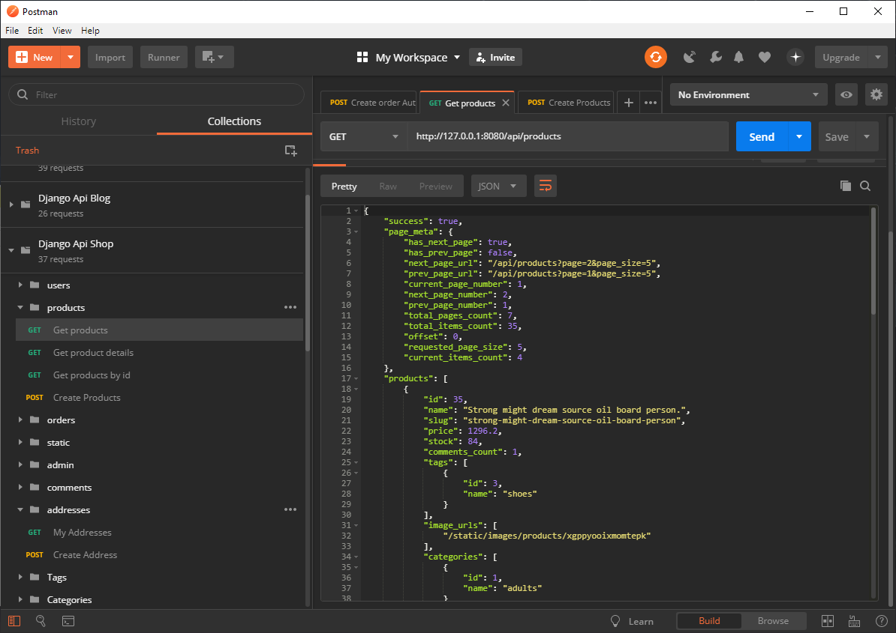
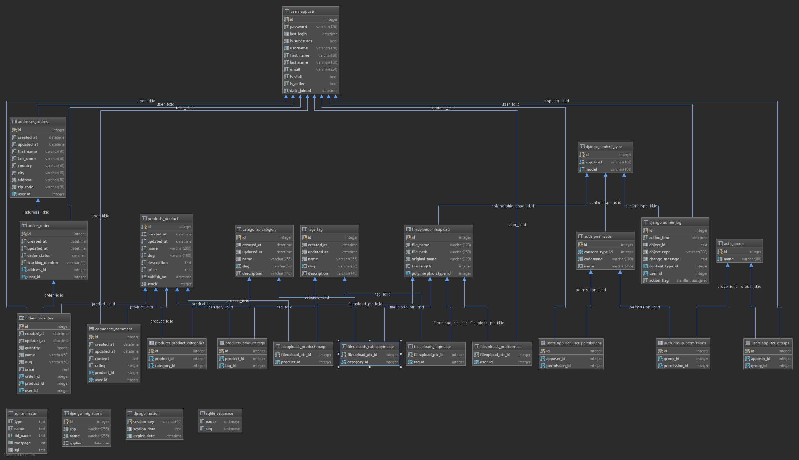

# Introduction
This is one of my E-commerce API app implementations. It is written in python, using Django and DRF as the main frameworks.
This is not a finished project by any means, but it has a valid enough shape to be git cloned and studied if you are interested in this topic.
If you are interested in this project take a look at my other server API implementations I have made with:

- Django

## WARNING
I have mass of projects to deal with so I make some copy/paste around, if something I say is missing or is wrong, then I apologize
and you may let me know opening an issue.

# Getting started
1. Git clone the project
2. In windows run reset_all.ps1, in linux reset_all.sh, or take line by line and execute them yourself in your terminal window,
please notice that I run `python3` in that script because this is how I set up my pc, but if your default python 3 is accessible with
`python` then change it. This script is used to remove any migrations if any, remove the sqlite db if any, create the db and then migrate.
At the end of this step you have a db.sqlite3.

# TODO
- Improve error messages, for example when commenting a product without a being authenticated the error structur
is misleading, errors has to be a json object not a string.
 - The short url for comments, does not seem to work, /comments/:id does not work, but
 /products/:slug/comments/:pk does ... hum, fix it
 - Security:
    - Secure file upload
    - Secure all user input
    - CORS
- then run server with
`python3 manage.py runserver 8080`
It is convenient to use port 8080 because all the requests made in postman are using that port, the postman file is `api.postman_collection.json`,
you can import it and test the requests by yourself -)

# Features
- Authentication / Authorization
- Paging
- Products, Orders, OrderItems, Addresses, Custom User model, Tags, Categories, Comments, TimestampedModel, FileUpload(Polymorphic)
- Products associated to images, file upload without any 3party package
- CRUD operations on products, comments, tags, categories

- Orders, guest users may place an order

# What you will learn
- Django
    - middlewares
    - authentication
    - authorization
- Django ORM
    - associations: hasMany, belongsTo, belongsToMany
    - scopes
    - complex queries
    - paging
    - eager loading, select columns
    
        
- seed data with python-faker

- misc
    - project structure
    
    
# Resources
- [Django framework](https://www.djangoproject.com/)
- [Django rest framework](https://www.django-rest-framework.org/)
- [django-rest-framework-jwt](https://github.com/GetBlimp/django-rest-framework-jwt)
- [Django ORM Cookbook](http://books.agiliq.com/projects/django-orm-cookbook/en/latest/index.html) IMO, the best Django ORM Resource.
- [django-polymorphic](https://django-polymorphic.readthedocs.io/en/stable/) FileUpload, ProductImage, TagImage, CategoryImage are implemented using this package

 
